# kottans-frontend

## Curriculum:

#### General

- [x] 
    1. [Git Basics](#git-basics)
- [x] 
    2. [Linux CLI and Networking](#linux-cli-and-http)
- [x] 
    3. [VCS (hello gitty), GitHub and Collaboration](#git-collaboration)

#### Front-End Basics

- [x] 
    4. [Intro to HTML & CSS](#intro-to-html-and-css)
- [x] 
    5. [Responsive Web Design](#responsive-web-design)
- [x] 
    6. [HTML & CSS Practice](#html-&-css)
- [x] 
    7. [JavaScript Basics](#javascript-basics)
- [x] 
    8. [Document Object Model](#document-object-model)

#### Advanced Topics

- [ ] 
    9. [Building a Tiny JS World (pre-OOP)](#building-a-tiny-js-world)
- [ ] 
    10. [Object-oriented JS](#object-oriented-js)
- [ ] 
    11. [OOP exercise](#oop-exercise)
- [ ] 
    12. [Offline Web Applications](#offline-web-applications)
- [ ] 
    13. [Memory pair game](#memory-pair-game)
- [ ] 
    14. [Website Performance Optimization](#website-performance-optimization)
- [ ] 
    15. [Friends App](#friends-app)

---

## General

---

### Git Basics

#### Version Control with Git

The Udacity allows you to learn basic knowledge and understanding how git works, and I think it course was useful for
me. Before this course I didn't know how git works, but now, it's clear for me.

Screenshot

#### Learn Git branching interactive course

This was interesting for me

Screenshot

#### Summary

I understood how git is working and how i can use it.

### Linux CLI and HTTP

#### Linux Survival

Almost all of these commands I know and as for me there is nothing new.

Screenshot-1

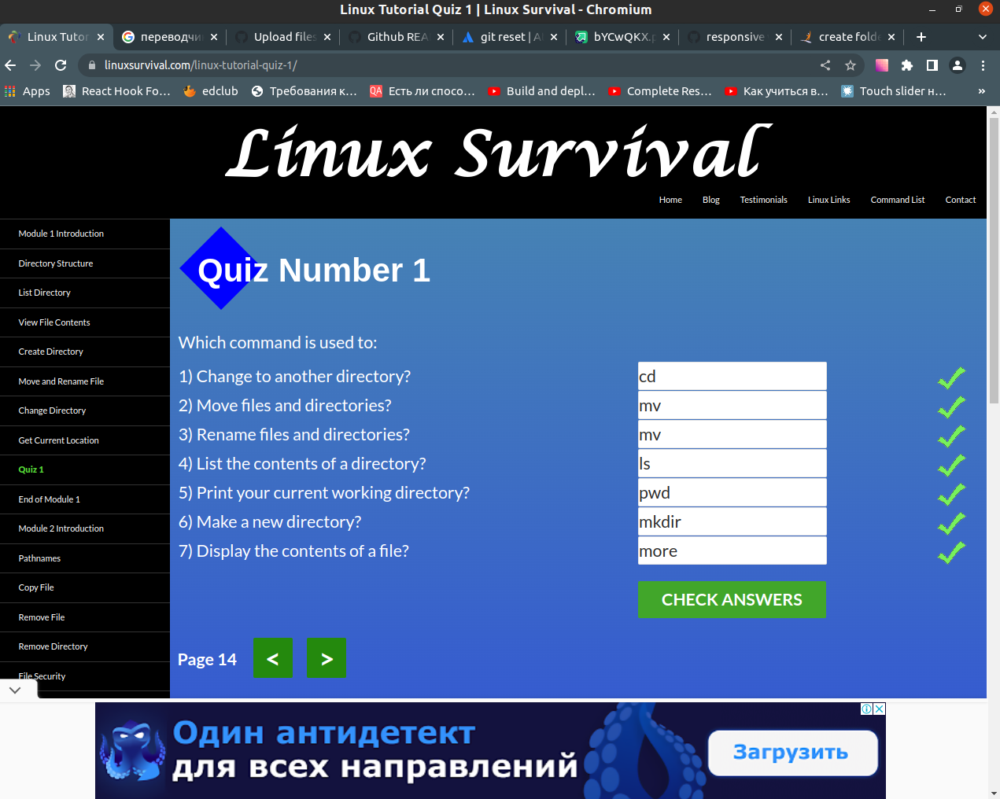

Screenshot-2

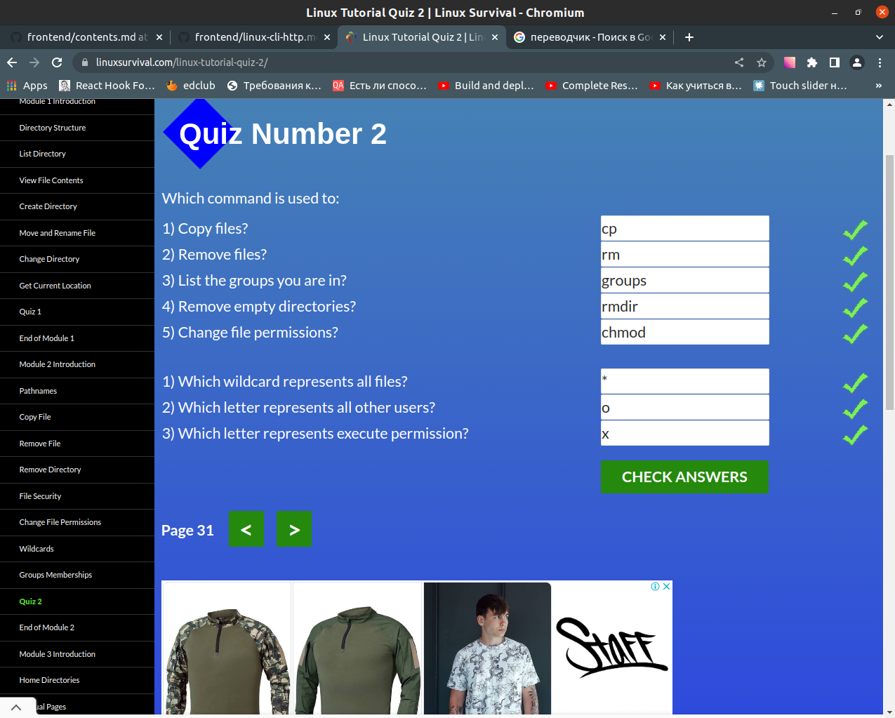

Screenshot-3

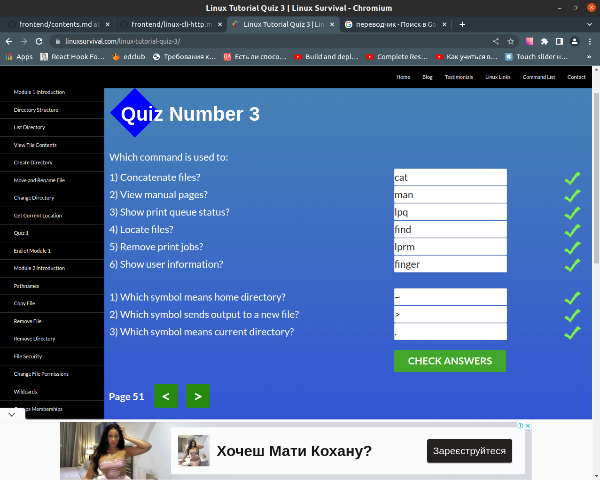

Screenshot-4

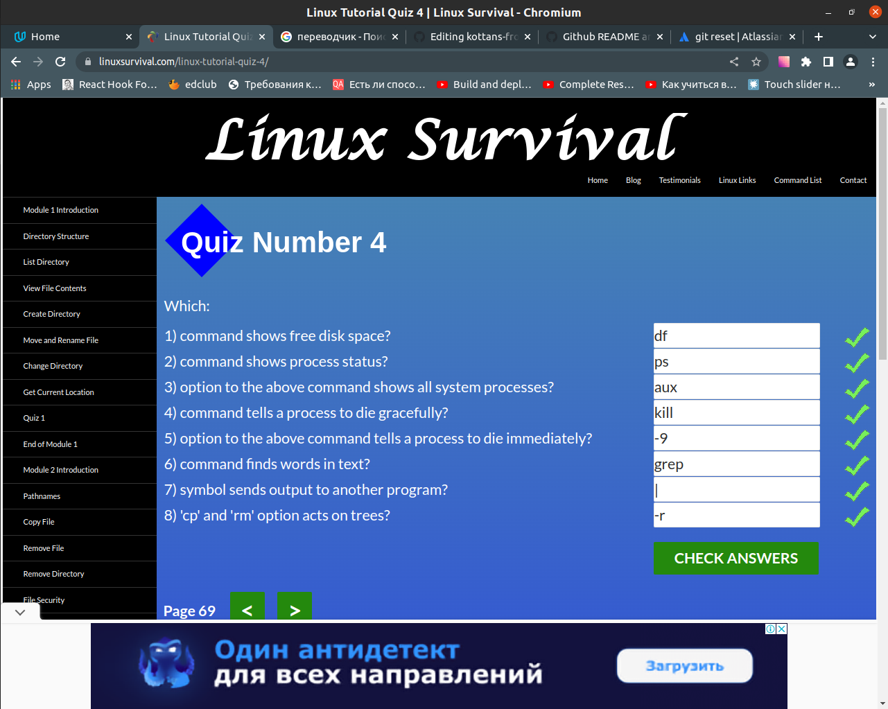

#### Articles about HTTP

Two articles was very interesting for me and now it's clear, how occur interaction between client and server.

### Git Collaboration

#### Udacity course

As for me this was exited course. Now I know how to interact with team.

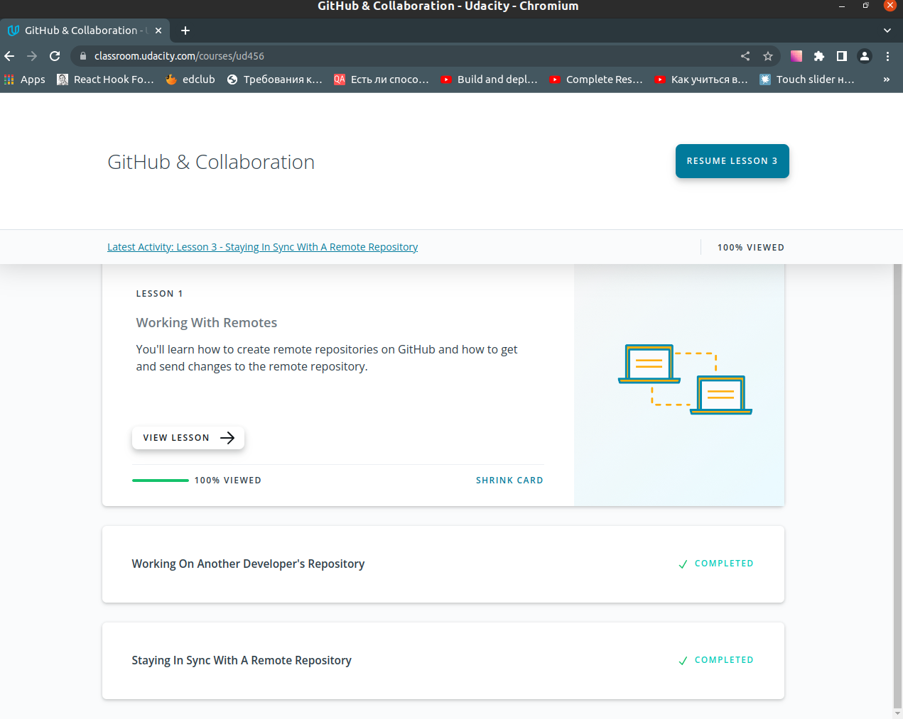

#### Learn git branching

It was difficult, and I think there are things which I will never use.

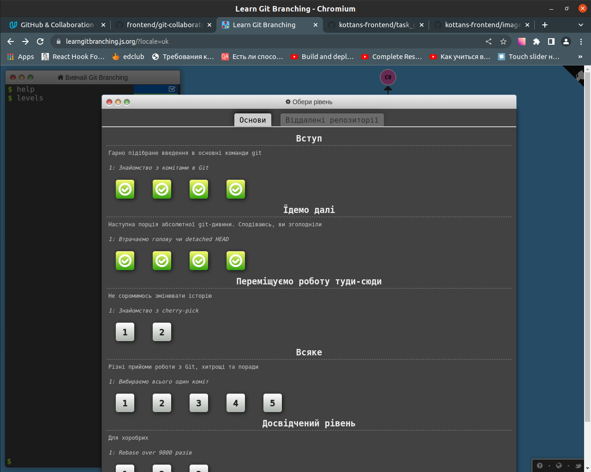

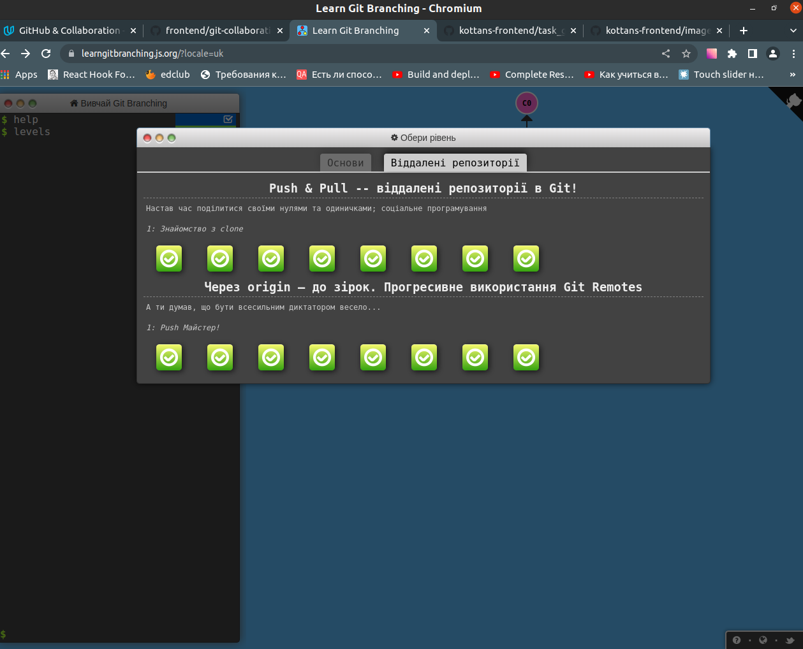

---

## Front-End Basics

---

### Intro to HTML and CSS

#### [HTML, CSS, and Javascript for Web Developers](https://www.coursera.org/learn/html-css-javascript-for-web-developers)

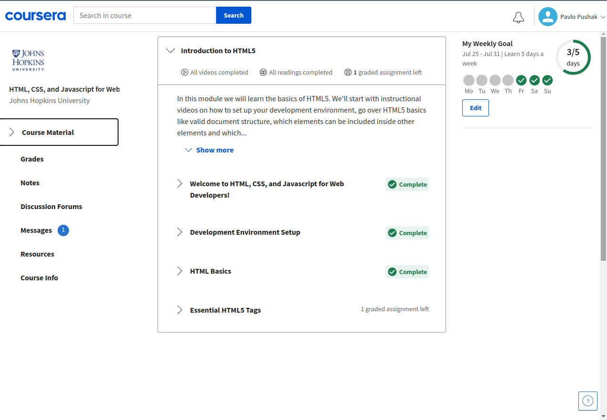

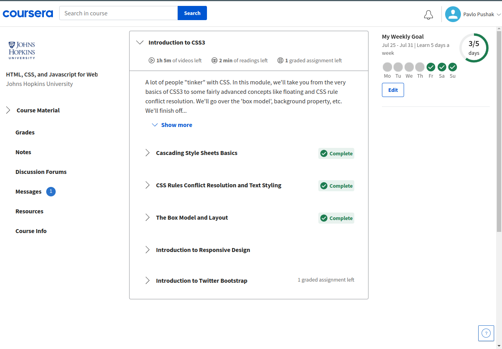

Almost all I have already known, but something was new for me. For example, I didn't know about margins collapse and how
can I wrap around the picture using float. This was interesting course.

#### [Codecademy HTML](https://www.codecademy.com/learn/learn-html)

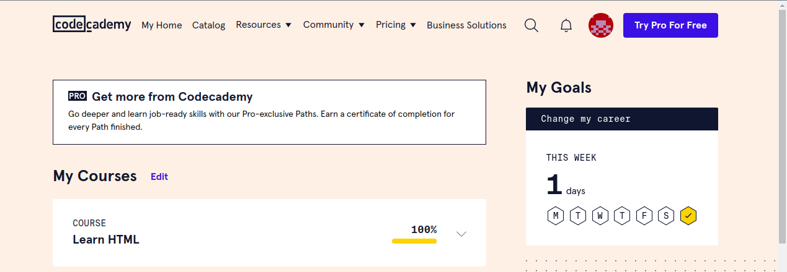

#### [Codecademy CSS](https://www.codecademy.com/learn/learn-css)

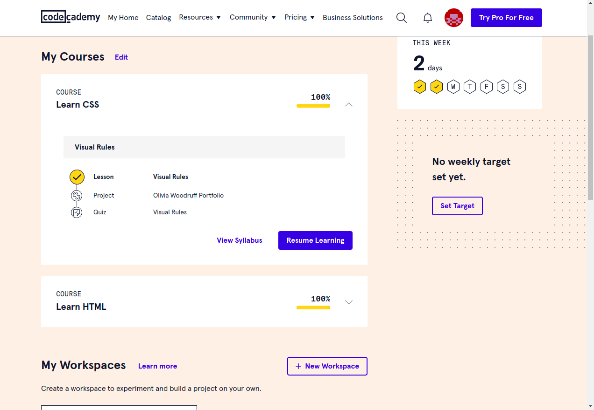

These courses have a lot of practice and I think it will be useful for me. Now I know how I can add a downloaded fonts.
It was new for me.

### Responsive Web Design

**[Responsive web design basics](https://web.dev/i18n/en/responsive-web-design-basics/)**

I already know some things about Responsive Web Design. For me there is nothing new in this article.

**[Flexbox Froggy](http://flexboxfroggy.com/)**

I have already played this game.

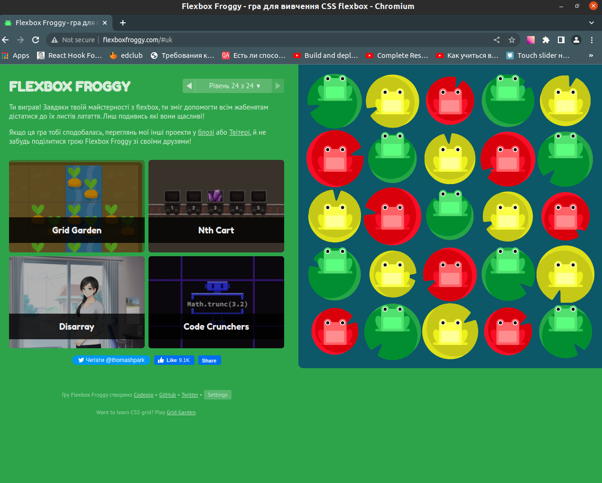

**[Grid Garden](http://cssgridgarden.com/)**

In this game I have learned Grid, and I had a lot of fun.

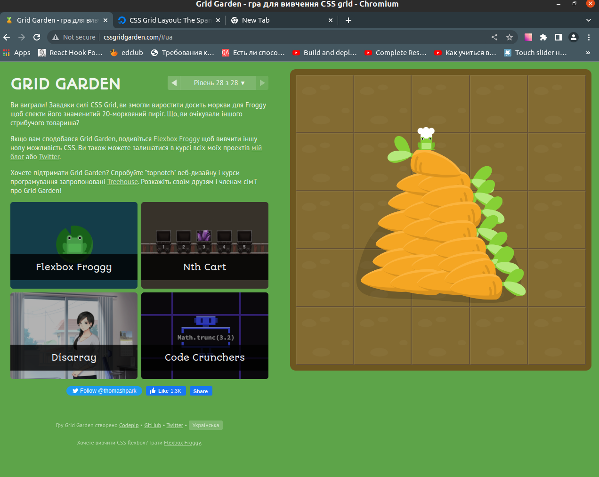

**Summary**

In this block I have learned  Grid which I didn't know at all.And repeated the flexbox to himself. Now I know how Grid and Flexbox works and I will use this knowledge in the future.

### HTML & CSS Practice
This was interesting task.

[Demo](https://pashapushak1996.github.io/html-css-popup-kottans/) |
[Code base](https://github.com/pashapushak1996/html-css-popup-kottans)

### JavaScript Basics

**[JS Basics Coursera](https://www.coursera.org/learn/html-css-javascript-for-web-developers/home/week/4)**

It was interesting for me. Now I have learned how closures and "this" in objects works.

**[freeCodeCamp](https://www.freecodecamp.org/learn)**

Basic Javascript

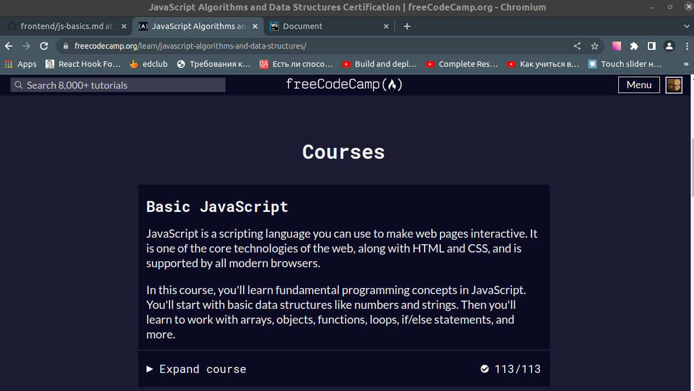

ES6 Challenges

Basic Data Structures

Basic Algorithm Scripting

Functional Programming

Algorithm Scripting Challenges

I have learned a lot of thinks, and now I know how exactly JS work.
The last tasks were the most challenging, but It was very interesting.

