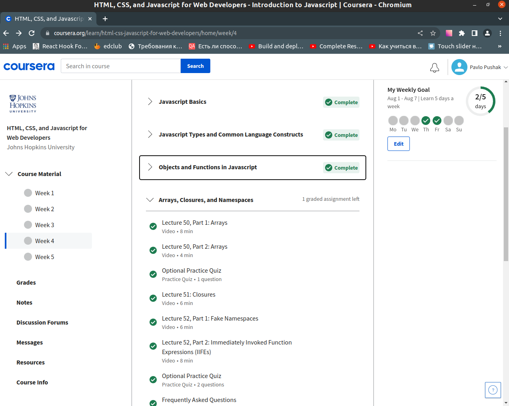
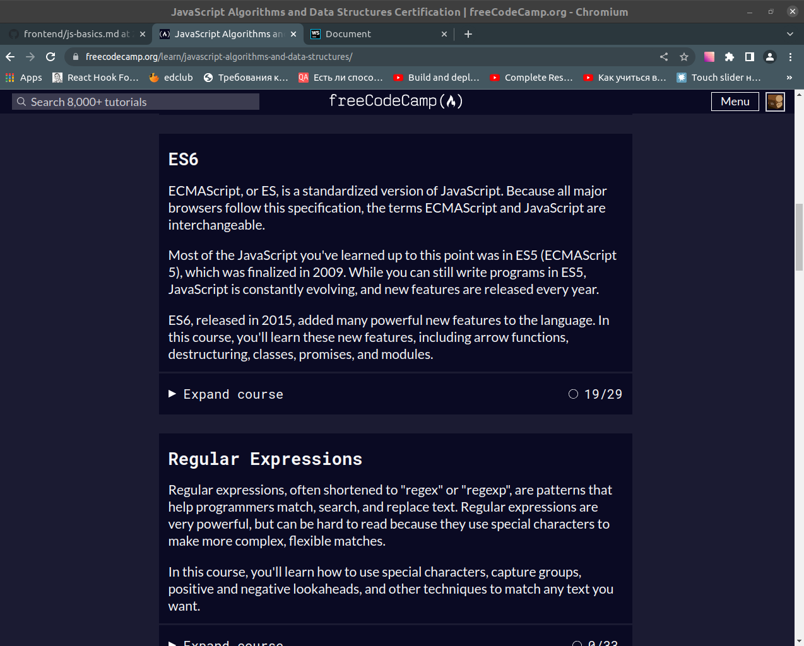
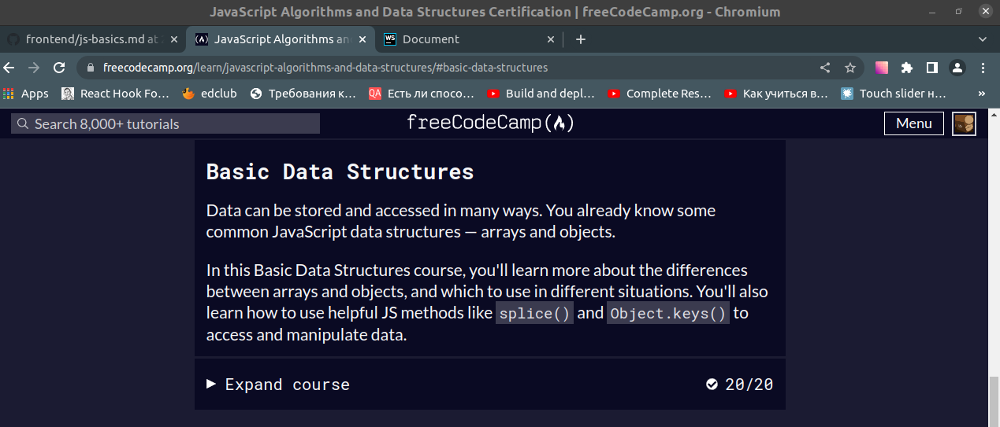
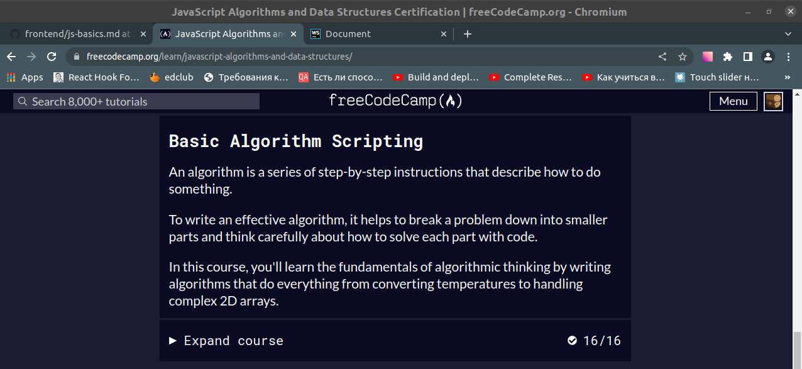
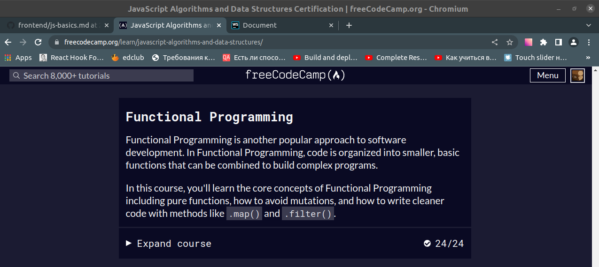
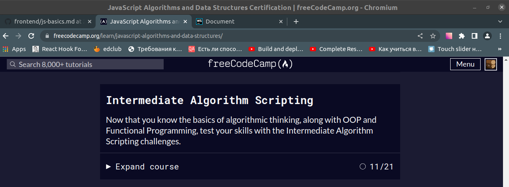
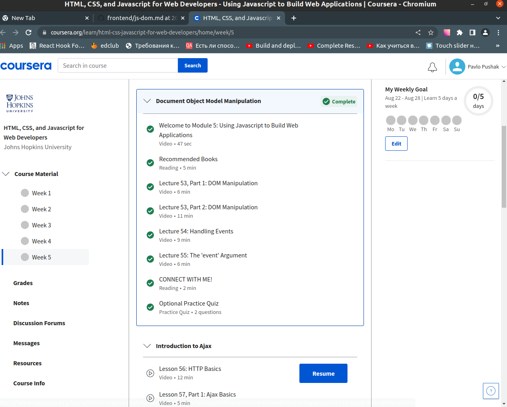
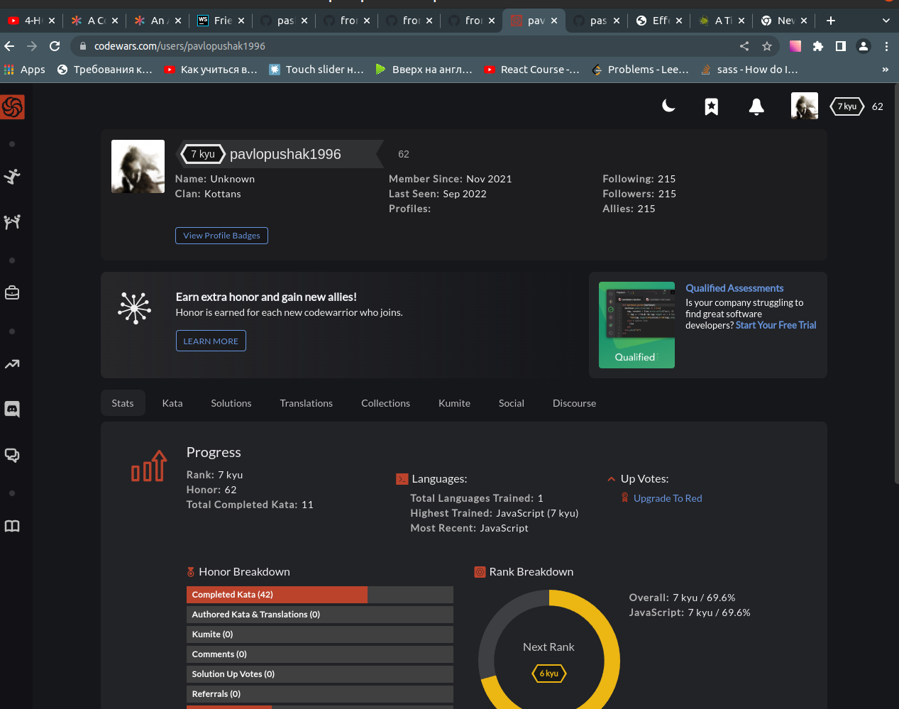

# kottans-frontend

## Curriculum:

#### General

- [x]  [Git Basics](#git-basics)
- [x]  [Linux CLI and Networking](#linux-cli-and-http)
- [x]  [VCS (hello gitty), GitHub and Collaboration](#git-collaboration)

#### Front-End Basics

- [x] [Intro to HTML & CSS](#intro-to-html-and-css)
- [x] [Responsive Web Design](#responsive-web-design)
- [x] [HTML & CSS Practice](#html--css-practice)
- [x] [JavaScript Basics](#javascript-basics)
- [x] [Document Object Model](#document-object-model)

#### Advanced Topics

- [x] [Building a Tiny JS World (pre-OOP)](#building-a-tiny-js-world)
- [x] [Object-oriented JS](#object-oriented-js)
- [x] [OOP exercise](#oop-exercise)
- [ ] [Offline Web Applications](#offline-web-applications)
- [ ] [Memory pair game](#memory-pair-game)
- [ ] [Website Performance Optimization](#website-performance-optimization)
- [ ] [Friends App](#friends-app)

---

## General

---

### Git Basics

#### Version Control with Git

The Udacity allows you to learn basic knowledge and understanding how git works, and I think it course was useful for
me. Before this course I didn't know how git works, but now, it's clear for me.

Screenshot

#### Learn Git branching interactive course

This was interesting for me

Screenshot

#### Summary

I understood how git is working and how i can use it.

### Linux CLI and HTTP

#### Linux Survival

Almost all of these commands I know and as for me there is nothing new.

Screenshot-1

Screenshot-2

Screenshot-3

Screenshot-4

#### Articles about HTTP

Two articles was very interesting for me, and now it's clear, how occur interaction between client and server.

### Git Collaboration

#### Udacity course

As for me this was exited course. Now I know how to interact with team.

#### Learn git branching

It was difficult, and I think there are things which I will never use.

---

## Front-End Basics

---

### Intro to HTML and CSS

#### [HTML, CSS, and Javascript for Web Developers](https://www.coursera.org/learn/html-css-javascript-for-web-developers)

Almost all I have already known, but something was new for me. For example, I didn't know about margins collapse and how
can I wrap around the picture using float. This was interesting course.

#### [Codecademy HTML](https://www.codecademy.com/learn/learn-html)

#### [Codecademy CSS](https://www.codecademy.com/learn/learn-css)

These courses have a lot of practice and I think it will be useful for me. Now I know how I can add a downloaded fonts.
It was new for me.

### Responsive Web Design

**[Responsive web design basics](https://web.dev/i18n/en/responsive-web-design-basics/)**

I already know some things about Responsive Web Design. For me there is nothing new in this article.

**[Flexbox Froggy](http://flexboxfroggy.com/)**

I have already played this game.

**[Grid Garden](http://cssgridgarden.com/)**

In this game I have learned Grid, and I had a lot of fun.

**Summary**

In this block I have learned Grid which I didn't know at all.And repeated the flexbox to himself. Now I know how Grid
and Flexbox works and I will use this knowledge in the future.

### HTML & CSS Practice

This was interesting task.

[Demo](https://pashapushak1996.github.io/html-css-popup-kottans/) |
[Code base](https://github.com/pashapushak1996/html-css-popup-kottans)

### JavaScript Basics

**[JS Basics Coursera](https://www.coursera.org/learn/html-css-javascript-for-web-developers/home/week/4)**

It was interesting for me. Now I have learned how closures and "this" in objects works.

**[freeCodeCamp](https://www.freecodecamp.org/learn)**

Basic Javascript

ES6 Challenges

Basic Data Structures

Basic Algorithm Scripting

Functional Programming

Algorithm Scripting Challenges

I have learned a lot of thinks, and now I know how exactly JS work.
The last tasks were the most challenging, but It was very interesting.

### Document Object Model

**[Coursera JS-DOM](https://www.coursera.org/learn/html-css-javascript-for-web-developers/home/week/5)**

DOM

There are things that I already knew, but some things were new to me. For example, DOMContentLoading. It was a bit boring.I guess I will rarely use this because we have frameworks:)

**[freeCodeCamp](https://www.freecodecamp.org/learn)**

Algorithm Scripting Challenges

It was difficult for me, but I get a lot of pleasure. Because I like to solve different problems. And these were interesting.

**Practical part**

[Demo](https://pashapushak1996.github.io/js-dom-kottans) /
[Code](https://github.com/pashapushak1996/js-dom-kottans)

### Building a Tiny JS World (pre-OOP)

[Demo](https://pashapushak1996.github.io/a-tiny-JS-world/) /
[Code](https://github.com/pashapushak1996/frontend-2022-homeworks/tree/tiny-world)

### Object-oriented JS
**[Codewars](https://www.freecodecamp.org/learn)**

[My profile](https://www.codewars.com/users/pavlopushak1996)

There are a lot of tasks which I find good for me. I often solve different tasks on Codewars and I like it.

**Frogger game**

That was interesting and a bit hard for me. But I like difficult things.

[Demo](https://pashapushak1996.github.io/frogger-game/) /
[Code](https://github.com/pashapushak1996/frogger-game)

### OOP Exercise

[Demo](https://pashapushak1996.github.io/a-tiny-JS-world/) /
[Code](https://github.com/pashapushak1996/frontend-2022-homeworks/tree/tiny-world)

